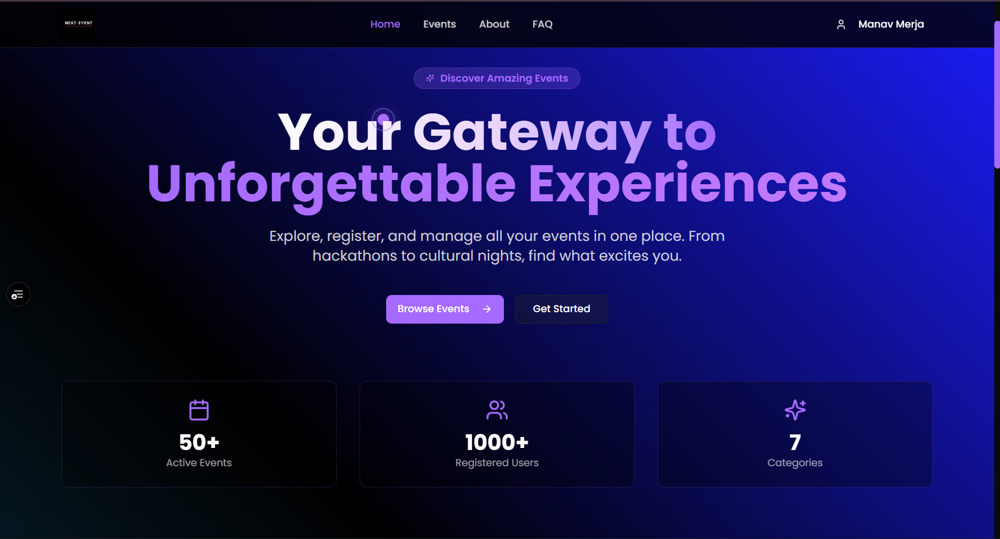
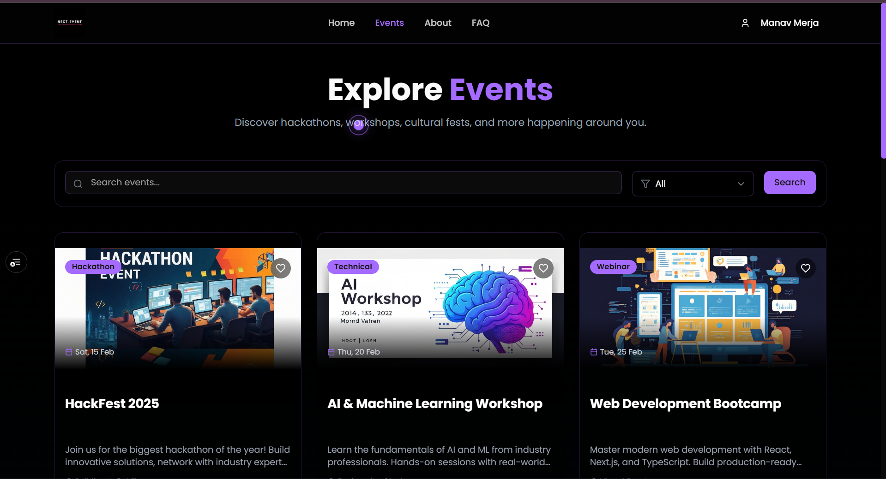
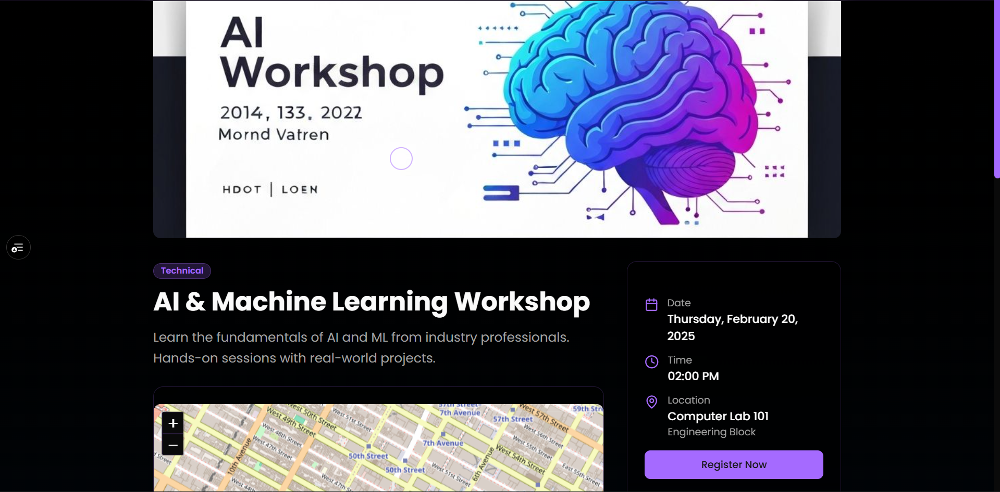
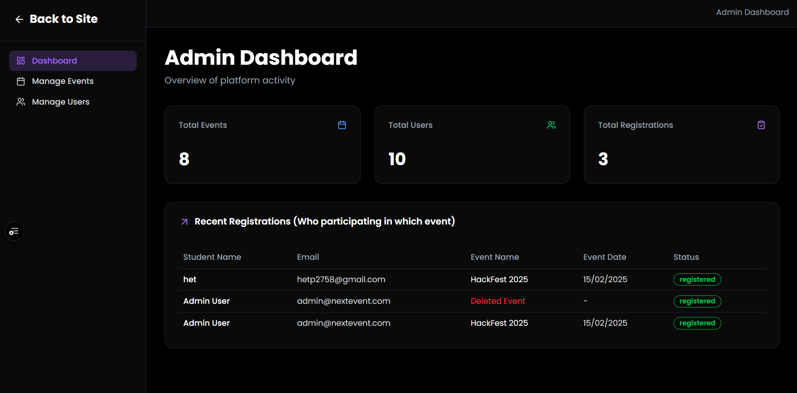

<div align="center">

  <br />
  
  
  <br />

  <h1 align="center">🚀 Next Event</h1>

  <h3 align="center">The Ultimate Cyberpunk Event Discovery Platform</h3>

  <p align="center">
    Built for the <strong>GitHub Developer Program</strong>. Powered by Next.js 15 & MERN.
    <br />
    <a href="https://v0-event-aggregator-web-app.vercel.app"><strong>⚡ View Live Demo</strong></a>
    ·
    <a href="https://github.com/manavmerja/Next-Event/issues">🐛 Report Bug</a>
    ·
    <a href="https://github.com/manavmerja/Next-Event/pulls">✨ Request Feature</a>
  </p>

  <p align="center">
    <a href="https://skillicons.dev">
      
    </a>
  </p>

  <p align="center">
    
    
    
    
  </p>
</div>

---

---

## 📸 Project Screenshots

> A glimpse into the Cyberpunk UI and functionality.

| **🏠 Home & Landing Page** | **🔍 Explore & Filter Events** |
|:---:|:---:|
|  |  |
| *Immersive Hero section with Neon aesthetics* | *Advanced search with Category & Date filters* |

<br />

| **🎫 Event Card & Details** | **🛡️ Admin Dashboard** |
|:---:|:---:|
|  |  |
| *Detailed view with Maps, Schedule & Wishlist* | *Real-time analytics and Event management* |

---
## 📖 Table of Contents

- [About the Project](#-about-the-project)
- [Key Features](#-key-features)
- [Tech Stack](#-tech-stack)
- [Getting Started](#-getting-started)
- [Project Structure](#-project-structure)
- [API Documentation](#-api-endpoints)
- [Contributing](#-contributing)
- [Contact](#-contact)

---

## 🌟 About the Project

**Next Event** bridges the gap between event organizers and attendees with a **Cyberpunk-inspired UI**. Unlike traditional boring lists, Next Event uses neon aesthetics, fluid animations, and a "Dark-First" approach to make event discovery exciting.

It leverages **Next.js 15 (App Router)** for SEO and speed, backed by a robust **Express/MongoDB** architecture.

### Why this project?
* 🚀 **Speed:** Optimized with Server Components.
* 👁️ **Visuals:** Uses Framer Motion for high-end feel.
* 🔐 **Security:** HttpOnly Cookies & JWT implementation.

---

## ✨ Key Features

### 🚀 **User Experience**
- 🔍 **Intelligent Discovery:** Real-time search with categories (Hackathons, Sports, Music).
- 🗺️ **Rich Data:** Integrated Leaflet maps & detailed schedules.
- ❤️ **Interactive Wishlist:** Neon Cyan Glow effect on bookmarking.
- ⭐ **Reviews:** 5-star rating system with feedback.
- 👤 **Dashboard:** Track registered events & history.
- 🔐 **Secure Auth:** JWT via httpOnly cookies (SameSite support).

### 🛡️ **Admin Powers**
- 📊 **Visual Analytics:** Graphs for total users, events, and registrations.
- 📝 **CRUD Management:** Create, Edit, Delete events seamlessly.
- 👥 **User Control:** Manage roles (Student ↔ Admin).
- 📋 **Registration Logs:** Export attendee lists.

### 🎨 **UI/UX Magic**
- **Theme:** Cyberpunk Dark (`#0a0a0a`) with **Neon Cyan (`#00F0FF`)** accents.
- **Animations:** Page transitions powered by **Framer Motion**.
- **Responsive:** Mobile-first grid layout.

---

## 🛠 Tech Stack

| Domain | Technologies |
| :--- | :--- |
| **Frontend** | `Next.js 15` `TypeScript` `Tailwind CSS v4` `Framer Motion` `Lucide Icons` |
| **Backend** | `Node.js` `Express.js` `REST API` |
| **Database** | `MongoDB Atlas` `Mongoose ODM` |
| **Auth** | `JWT` `Bcrypt` `HttpOnly Cookies` |
| **DevOps** | `Vercel` `Render` `GitHub Actions` |

---

## 🚀 Getting Started

### 1. Clone the repository
```bash
git clone [https://github.com/manavmerja/Next-Event.git](https://github.com/manavmerja/Next-Event.git)
cd next-event
2. Install dependencies
Bash

# Frontend & Backend dependencies
pnpm install
3. Environment Setup
Create a .env file in the root directory:

Code snippet

MONGODB_URI=mongodb+srv://<user>:<pass>@cluster.mongodb.net/next-event
JWT_SECRET=your_super_secret_key
NEXT_PUBLIC_API_URL=http://localhost:3001/api
NODE_ENV=development
4. Run the App
Bash

# Runs both Frontend (3000) & Backend (3001)
pnpm run dev
📂 Project Structure
Bash

next-event/
├── app/                  # Next.js 15 App Router
│   ├── (auth)/           # Login & Register Groups
│   ├── (dashboard)/      # Protected User/Admin Routes
│   └── events/           # Public Event Listings
├── components/           # ShadCN & Custom Components
├── server/               # Express Backend Logic
│   ├── controllers/      # Business Logic
│   ├── models/           # DB Schemas
│   └── routes/           # API Endpoints
└── public/               # Static Assets

## 📡 API Endpoints

<details>
<summary>👇 Click to expand API Details</summary>

| Method | Endpoint | Access | Description |
| :--- | :--- | :--- | :--- |
| `POST` | `/api/auth/login` | 🟢 Public | Authenticate user & set cookie |
| `POST` | `/api/auth/signup` | 🟢 Public | Register a new account |
| `GET` | `/api/events` | 🟢 Public | Fetch all events (supports filtering) |
| `POST` | `/api/events` | 🔴 Admin | Create a new event |
| `POST` | `/api/reviews/:id` | 🟡 Private | Submit a rating/review |

</details>

🤝 Contributing
Fork the Project

Create your Feature Branch (git checkout -b feature/AmazingFeature)

Commit your Changes (git commit -m 'Add some AmazingFeature')

Push to the Branch (git push origin feature/AmazingFeature)

Open a Pull Request

📞 Contact
Manav Merja

<div align="center"> <i>Built with ❤️, TypeScript, and lots of ☕ Chaai</i> </div>